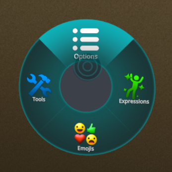
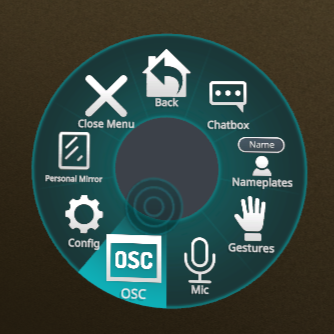
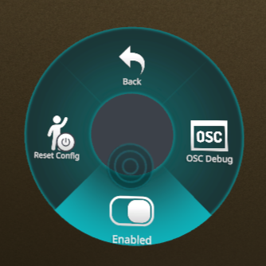
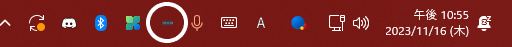
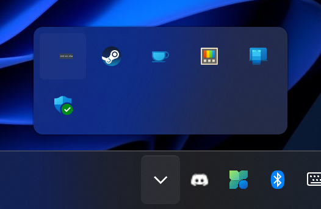

# remote vrc-chatbox for Android

flutterってクロスプラットフォームやろ！！と思ったあなた、apple製品を一つも持っていないので…

## なにこれ？

Androidスマホから VRChat のチャットボックスに文字・音声を送るアプリです。

 → 

## notice

> [!NOTE]
> QUEST単機でも使えるよ！
>   

> [!NOTE]
> windows側に何かインストールする？
>   
> ***入れなくても動きます！！！*** スマホにアプリインストールして文字打つだけ！　【nomalモード】
>   
> 一緒に配布している **rVRCc server** を Windows に入れると、クリップボード共有が使えてスマホから iwasync などに URL を貼り付けるのが便利です　【advancedモード】

## 事前準備

### - アプリ側 (IP設定)

初回はVRChatが動いているPC（またはQuest）のローカルIPアドレスの設定が必要です。

- ドロワー（左からスワイプ）→「IP設定」をタップ → ローカルIPアドレスを入力して保存
- **再起動不要** — 保存すると即時反映されます

> [!TIP]
> PCVRのIPアドレスの調べ方 → [ここ](http://w1loh.com/other/remote_vrc_chatbox_tips) を参考に
>  
> QUEST単機のIPアドレスの調べ方 → [quest ip searcher](https://github.com/w1loh/search_quest_IP) を使って取得

### - VRChat側 (OSCを有効化)

VRC側のパイメニューで OSC を Enabled（右側）にしてください。

  

## 機能

### - テキスト送信

下部の入力欄にテキストを入力し、右の紙飛行機ボタンまたはキーボードの送信で送れます。送信時にSEが鳴ります。

入力欄左の「…」メニューからコピー・削除・URL開く・翻訳ができます。

### - 音声入力（PTT / 連続認識）

ドロワーの「音声入力モード」スイッチで2つのモードを切り替えられます。

**PTT（プッシュトゥトーク）**
マイクボタンを**押している間**ずっと音声認識します。離すと自動送信。

**連続認識モード**
マイクボタンを**タップ**するとずっとマイクが有効になり、発話の切れごとに自動送信します。もう一度タップで停止。

### - 掲示モード

ドロワーの「掲示モード」スイッチを ON にすると有効になります。

- 送信したメッセージを **20秒ごとに自動で繰り返し送信**します（ループ送信は履歴に積み重ねません）
- 最新の履歴カードにカウントダウンのプログレスバーが表示されます
- 掲示モード中に送信した履歴には看板アイコンが付きます

### - 履歴参照と編集

セッション中（アプリを閉じるまで）は送信履歴が蓄積されます。履歴カード右のペンアイコンをタップすると入力欄にコピーされます。

### - 日英翻訳

入力欄に文字を入力 → 「…」メニュー → 翻訳 で Google 翻訳が使えます。翻訳結果を入力欄にペーストして送信できます。

### - 被共有

YouTube やブラウザで選択した文字を共有すると自動で起動して入力欄に挿入されます。

 

### - 画面分割対応

Twitter やブラウザを使いながらチャットボックスの送信ができます。

### - クリップボード送信

> [!NOTE]
> **advancedモード**（Windows側で rVRCc_server を起動している場合）限定の機能です。nomalモードではボタンがグレーアウトしています。

**スマホ → PC**
入力欄にURLや文字列を入力してクリップボードボタンを押すと、PC側で貼り付けできます。iwasync などへのURL貼り付けに便利。

**PC → スマホ**
入力欄が空の状態でクリップボードボタンを押すと、PCのクリップボードをスマホに取り込めます。[T.O.N](https://vrchat.com/home/world/wrld_a61cdabe-1218-4287-9ffc-2a4d1414e5bd) などの復活の呪文をスマホに素早く保存できます。

 

### - タイピング中表示

ドロワーの「タイピング中表示」を ON にすると、入力欄に文字があるとき VRChat の頭上に「…」が表示されます。

### - ダーク / ライトモード

右上のアイコンでいつでも切り替えられます。設定は保存されます。

## ドロワーメニュー

左端からスワイプして開きます。

| 項目 | 説明 |
|---|---|
| IP設定 | 接続先のローカルIPアドレスを設定（再起動不要） |
| タイピング中表示 | 入力中に「…」を頭上に表示 |
| 音声入力モード | OFF: PTT / ON: 連続認識 |
| 掲示モード | 最新の送信を20秒ごとにループ送信 |
| 通信方式 | nomal(OSC) ↔ advanced(WebSocket) |
| 再接続 | advancedモード時に手動で再接続 |
| 作者のリンク集 | 作者（w1loh）のリンク集を開く |
| マニュアル・プライバシーポリシー | GitHubを開く |
| 法的表示 | 使用ライブラリのライセンス一覧 |

## rVRCc_server について

> [!NOTE]
> ***クリップボード共有機能を使わないのであれば必要ありません。***

> [!WARNING]
> 起動してもウィンドウは出ません。多重起動に注意してください。

> [!TIP]
> スタートアップ登録しておくと便利です。([参考](https://support.microsoft.com/ja-jp/windows/windows-10-%E3%81%AE%E8%B5%B7%E5%8B%95%E6%99%82%E3%81%AB%E8%87%AA%E5%8B%95%E7%9A%84%E3%81%AB%E5%AE%9F%E8%A1%8C%E3%81%99%E3%82%8B%E3%82%A2%E3%83%97%E3%83%AA%E3%82%92%E8%BF%BD%E5%8A%A0%E3%81%99%E3%82%8B-150da165-dcd9-7230-517b-cf3c295d89dd))

起動中はタスクトレイにアイコンが表示されます。右クリック →「終了する」で終了できます。

 

見つからない場合は `^` アイコンの中に隠れているかもしれません。

## ダウンロード

[>>> こちら <<<](https://github.com/w1loh/remote_vrc_chatbox/releases)
